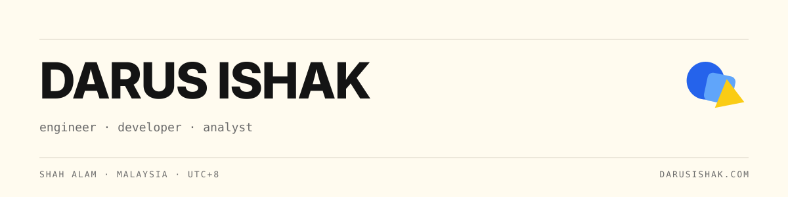

<picture>
  <source media="(prefers-color-scheme: dark)" srcset="assets/banner-dark.svg">
  
</picture>

> [!NOTE]
> Chemical engineer turned data engineer. 
> Biogas and solar plant operations, from SCADA tags to dashboards.

| Portfolio | Studio | Email |
|:--|:--|:--|
| [darusishak.com](https://darusishak.com) | [rujilabs.com](https://rujilabs.com) | [info@rujilabs.com](mailto:info@rujilabs.com) |

<!-- you read the source. hello. -->
